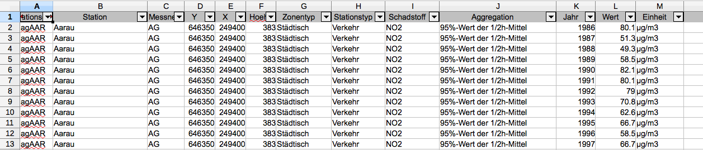
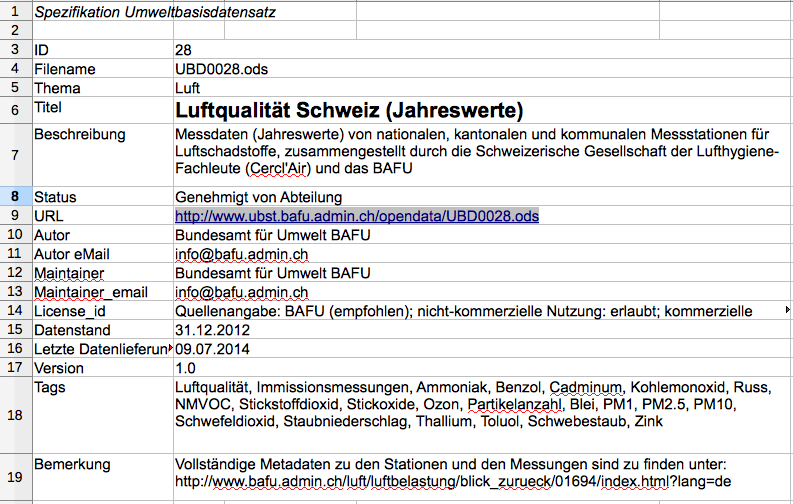
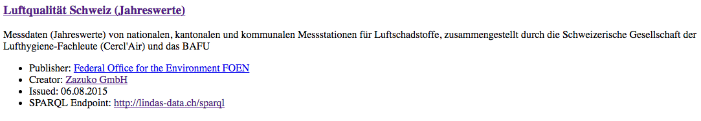
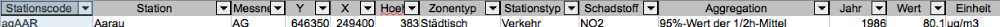
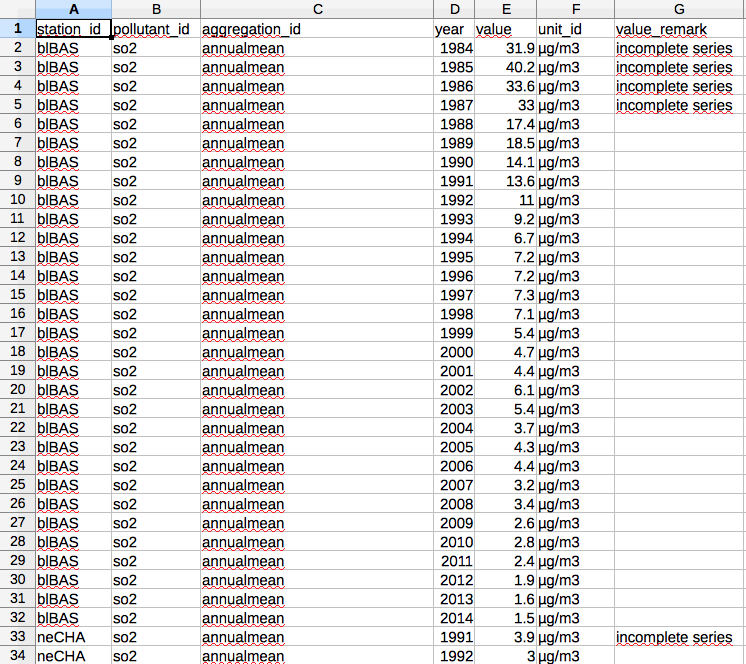
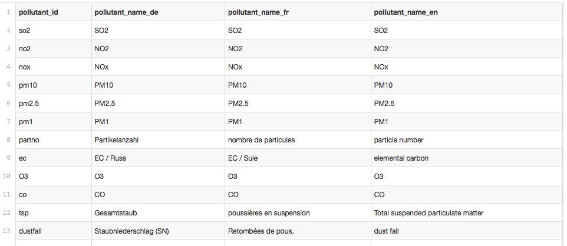

# From Tabular to Linked Data using Data Cubes

Within a [LINDAS use case with FOEN](https://github.com/lindas-uc/bafu_ubd) we converted various data sets from the Federal Office for the Environment FOEN to Linked Data. This document describes how we went about and can be used as guidelines for similar data conversions.

## Introduction

As of today most tabular data is made available on institution websites or in open data portals like CKAN. CKAN is a data management system aimed at data publishers wanting to make their data open and available. It provides tools to facilitate this publishing step and helps finding and using data. The data quality completely depends on the data provider. Apart from adding some meta information, no further data enhancement is taking place on the platform. Thus, the data that gets pushed into the system is the data which is made available to the user.

Tabular data is usually made available in CSV format or or as Excel/OpenOffice spreadsheets. App developers need to download the raw data and process it using their own ETL (Extract, Transform, Load) processes. With every update of the raw data the ETL process has to be triggered for every single application where it is used. When the format of the raw data changes, the process has to be adjusted and cannot be automated. With every new data source, maintenance complexity of these open data sets and related apps increases.



In the case of FOEN processing the data in this way may not even be possible for the typical user: Many datasets contain millions or even billions of records. Loading such datasets in their entirety requires special tooling and cannot be done with the average spreadsheet application or database system. In discussions with FOEN it became clear, that this is one of the big challenges of the current approach: There is far more knowledge in the data sets available than what is visible and accessible to the average open data developer or researcher.

### Linked Data

With our linked data prototype we chose another approach: We converted the tabular data to a standardized format, loaded it to an appropriate database and provided a web based tool, which facilitates consumption of the datasets and provides a view of the dataset that resembles a standard spreadsheet. We also made sure the data or a subset of it can be exported to CSV again.

For doing so, we settled on the following standards:

* As data model we used RDF.
* To describe the tabular data in a re-useable way we used the Data Cube Vocabulary.
* The data was loaded to a so called triplestore database (provided by LINDAS).
* From there, we queried the data using SPARQL.

[RDF](http://www.w3.org/TR/rdf11-concepts/), [RDF Data Cube Vocabulary](https://www.w3.org/TR/vocab-data-cube/) and [SPARQL](https://www.w3.org/TR/sparql11-query/) are W3C standards and are implemented in a large variety of open source and commercial products.

We will not cover the basics of RDF within this document, please refer to the [RDF Primer](https://www.w3.org/TR/rdf11-primer/) for a basic introduction to RDF and/or the [Linked Data on Speed](http://presentations.zazuko.com/LD-Speed/#2) presentation. We also provide a list of [recommended books](http://presentations.zazuko.com/LD-Speed/#46) about the topic and implementations of the RDF model in [various programming languages](http://presentations.zazuko.com/LD-Speed/#47).


One of the basic concepts of RDF is that any piece of information is expressed with the help of URIs, as shown in the RDF Primer. By making these URIs available as "links" on the Web, people can follow the relationships in the data and find related information easily. RDF is thus also often called Linked Data and extends the classical Web of documents in a powerful way.

RDF provides support for multiple languages within its core. This is another feature we will use as we can describe meta data in the data cube in multiple languages with almost no extra effort.

### RDF Data Cube Vocabulary

Within the Linked Data community [Data Cube Vocabulary](http://www.w3.org/TR/vocab-data-cube/) is the most used and most useful vocabulary for converting multi dimensional tabular data to Linked Data and RDF. We just provide a basic introduction to this vocabulary; it is recommended to read the full specification and its example first. Within our prototype we did not provide a fully validated implementation of the Data Cube vocabulary, but focused on the most important aspects of it.

#### Data Set Metadata

In our prototype, all datasets are available as OpenOffice documents and CSV exports. The OpenOffice document provides the same data as the CSV plus additional meta data according to the [DCAT-AP Switzerland](https://dcat-ap-switzerland.readthedocs.org/en/latest/) profile. It also provides additional information about the structure of the data, key values, and whether an entry is mandatory or not. It serves as a basis for the DCAT & [VoID](https://www.w3.org/TR/void/) file, which is currently maintained outside the FOEN Github repository with other [LINDAS meta data](https://github.com/zazuko/lindas-datasets/blob/gh-pages/input/void.ttl).



This VoID file maps the metatata described in the OpenOffice file to its according RDF DCAT and VoID identifiers and should be pretty much self-explanatory. If you are unsure, you may want to consult the W3C [Data on the Web Best Practices](https://www.w3.org/TR/dwbp/) document.



#### Data Cube Metadata

As a next step one needs to define the Data Cube itself. We do that by maintaining one file per dataset which defines all the necessary meta data in one place. See [UBD28](https://github.com/lindas-uc/bafu_ubd/blob/master/input/meta/ubd28/qb.ttl) for a complete example.

Requirements:

* We need one `qb:DataSet` definition which is the base for everything else. This definition can contain comments & labels in multiple languages so users can easily find what they need. We should at least provide a `rdfs:label`, `rdfs:comment` and point to the `qb:structure` defined next. 
* In the `qb:DataStructureDefinition` we define all so-called components (all subclasses of `qb:ComponentProperty`) as `qb:DimensionProperty`, `qb:AttributeProperty` or `qb:MeasureProperty`. These components represent the columns in our tabular data. Usually one should provide one of these for each column in the CSV. The distinction between the three is a bit tricky, please refer to the Data Cube Vocabulary for more details and consult our example mapping. Note that the URIs for these components are used later when we map the rows to RDF.
* We also assign an order to the components by using the `qb:order` predicate. Lower value means higher order. This is useful for deciding which column should be shown first in a visualization.
* For each component we need to add additional meta data so they become more accessible for users. The more labels in multiple languages we add, the easier it becomes for the user to understand what this column is about. This label is also used in the generic [table viewer](http://cpvrlab.github.io/sparql-table-viewer/) as a name for the columns.



You can browse our definitions as Linked Data on the Web:

* http://environment.data.admin.ch/ubd/28/qb/ubd28
* http://environment.data.admin.ch/ubd/66/qb/ubd66

#### Describing a measurement

Once the meta data is set one can start to convert each row to RDF data. Data Cube Vocabulary is defining a class called `qb:Observation` for this. Every single row in the CSV file (except the header row) will be transformed to a `qb:Observation`. Obviously the most important information assigned to such an observation is what we measured. This means every observation contains a measured value, ideally an assigned unit, and all the other constraints necessary to uniquely describe this particular measurement. Doing this properly is essential; to do so, the `qb:ComponentProperty` described above can be re-used.



Once this is done, we are set and have a basic RDF Data Cube available.

Sample Measurement:

* http://environment.data.admin.ch/ubd/28/measurement/neLCF/O3/nodaysmaxhourlymeanabove120/2002
* http://environment.data.admin.ch/ubd/28/measurement/tiLUG/pb_dustfall/annualmean/1992

#### Normalizing re-occuring entries in columns

In our original spreadsheet file the same terms were used for describing a re-occurring item in a column. This makes it possible to use pivoting tools to quickly filter for a certain value. If we were to model the data in a relational database this would be modeled as a relation to its own table (normalization). This is what we need for RDF as well and for that reason the data got prepared that way upfront.



This makes it very easy to create RDF out of it which can then be referenced from the base table shown before. We will simply create unique URIs for each row and add `rdfs:labels` in all the available languages to the output.

Example:

* http://environment.data.admin.ch/ubd/28/pollutant/partno

## Conversion process

### Data preparation

The datasets were very well prepared by FOEN. All structural data was available as its own CSV file which made it extremely simple to expose everything as RDF. After first tests it was decided to introduce one additional column to the structural data: A field name which still looks well after it is [URL encoded](https://en.wikipedia.org/wiki/Percent-encoding). This is optional but it makes generated HTTP URIs in the RDF data much more readable. This work was done by the data owner for each row in the CSV.

Next to the structural data there is one base table. This table contains the "normalized" data according to the specification of the dataset. Each reference to another table is done using the field name mentioned above as key. This makes it very easy to reference the structural data, and the generated URI for each measure is human readable as well.

In our case, most of the original data is curated in relational databases. Therefore, generating the different exports could be done with views on the database structure. Alternatively, it would be possible to directly access the database using [R2RML](https://www.w3.org/TR/r2rml/), but as this would require ODBC access to the database this was dismissed in the context of the prototype for practical reasons.

### Tooling

To convert CSV data to Linked Data we used the [RML](http://rml.io/) standard and tool chain provided by [iMinds Multimedia Lab](http://www.iminds.be/) of Ghent University. RML defines an RDF vocabulary to map non-RDF data to RDF. Currently RML is able to convert XML, JSON and CSV data to RDF. In our prototype only CSV sources were used. Again, it is recommended to read the full [specification](http://rml.io/spec.html) to understand the details of the mappings described in this document.

An implementation of RML in Java is available on Github. The tool which is used in the prototype is [RMLMapper](https://github.com/RMLio/RML-Mapper) which provides a command line interface. It can be downloaded as a [Jar](https://github.com/RMLio/RML-Mapper/releases) on the RMLMapper page.

Conversion is automated in shell scripts which also get executed on Github commits using Travis. See [the build scripts](https://github.com/lindas-uc/bafu_ubd/tree/master/scripts) and the [Travis configuration](https://github.com/lindas-uc/bafu_ubd/blob/master/.travis.yml) for details.

### RML mapping

 To convert one of the datasets to RDF, RMLMapper is executed:

     java -jar ./lib/RMLMapper-0.1.jar -M config/ubd28.ttl -O target/ubd28.nt

The file `config/ubd28.ttl` contains the configuration for the UBD28 dataset. The output of this step is written into a file called `target/ubd28.nt` as NTriples.

Have a look at the configuration file. – For each CSV file we needed to do the following steps:

- create an RML mapping
- define the data source for this mapping
- define a subject
- add all predicates (properties) which should be mapped, in all languages

For the base table we needed to do one additional step:

- provide a link to the URIs for the structural data

We have provided an example for each step based on the UBD28 mapping.

#### Create an RML mapping

We can define all mappings in one single configuration file. To define a new RML mapping, we simply define a new subject in this configuration. Any name can be chosen, but it makes sense to use a name referring to what is being mapped. This name needs to be unique and cannot be re-used for any other mappings within this configuration.

Example for [UBD28](https://github.com/lindas-uc/bafu_ubd/blob/master/config/ubd28.ttl#L20):

    <#Pollutant>

#### Define the data source

After the mapping definition we needed to specify the data source and type. This was straightforward, as the data format was always CSV in our case.

Example for UBD28:

```turtle
<#Pollutant>
  rml:logicalSource [
    rml:source "target/input-utf8/input/ubd/28/CH_yearly_air_immission_pollutant_id.csv";
    rml:referenceFormulation ql:CSV
  ]; 
```

The property `rml:logicalSource` points to a blank node which defines the source file via `rml:source` and the mapping type (CSV) by specifying `rml:referenceFormulation ql:CSV`.

#### Define a subject

For each mapping a subject URI needs to be defined. This URI will identify the mapped data and should be persistent whenever possible. In the case of our well prepared data set this is again [straightforward](https://github.com/lindas-uc/bafu_ubd/blob/master/config/ubd28.ttl#L26):

```turtle
  rr:subjectMap [
    rr:template "http://environment.data.admin.ch/ubd/28/pollutant/{pollutant_id}";
    rr:class bafu:Pollutant ;
  ];
```

By definining `rr:template` we defined the URI to be used. The final part of the URI is the key of the table, in our example the row `pollutant_id` in the CSV file. This part will be URI encoded and added to the static prefix.

We also defined a class for the subject, in the case of the Data Cube Vocabulary this is usually done in one's own namespace, as we will see later. In this example the class is `bafu:Pollutant`.

#### Map predicates

The rest of the mapping is straightforward: Every attribute is to be mapped as an RDF predicate, [for example](https://github.com/lindas-uc/bafu_ubd/blob/master/config/ubd28.ttl#L31):

```turtle
    rr:predicateObjectMap [
    rr:predicate rdfs:label;
    rr:objectMap [
      rml:reference "pollutant_name_de";
      rr:language "de" ;
    ]
  ] ;
```

We created a so called `rr:predicateObjectMap` which tells RML what RDF predicate should be used and which attribute from the CSV is assigned to it. Optionally data types or languages can be added as well.

The predicate used in our example is `rdfs:label` and we mapped it to the CSV column `pollutant_name_de`. As this is a lanuage specific description we are telling RML that it should assign the German language to this label by specifying `rr:language "de"`. Language tags are non RDF specific and defined in IETF [BCP47](https://tools.ietf.org/html/bcp47).

In case of a data type we need to slightly adjust [the mapping](https://github.com/lindas-uc/bafu_ubd/blob/master/config/ubd28.ttl#L192):

```turtle
  rr:predicateObjectMap [
    rr:predicate bafu:year;
    rr:objectMap [
      rml:reference "year" ;
      rr:datatype xsd:gYear  
    ]
  ];
```

To map data types, `rr:datatype` is used in connection with a well known data type like `xsd:gYear`. Note that one should not invent one's own data types, but use data types defined in the SPARQL specification and/or in XML. Otherwise, the query engine might not be able to filter them properly.

In the example above we also invented our own predicate called `bafu:year`, this is again used in the Data Cube specification later.

#### Map the base table

The final step consists in mapping the base table. This is the table where we define the measurement itself, which is in the end what we want to make available in the data cube. Mapping a base table looks pretty much like mapping structural data, with [a few exceptions](https://github.com/lindas-uc/bafu_ubd/blob/master/config/ubd28.ttl#L207):

* The subject might have multiple classes, in our example `bafu:Measurement` (defined by ourself) and `qb:Observation`, which is defined in the Data Cube Vocabulary.
* The URI of the subject needs to contain _all_ key values defined in the dataset. Add them separated by a slash (`/`). In our case, we ordered it according to the order of the specification in OpenOffice format. [Example](https://github.com/lindas-uc/bafu_ubd/blob/master/config/ubd28.ttl#L214):

```turtle
rr:template "http://environment.data.admin.ch/ubd/28/measurement/{station_id}/{pollutant_id}/{aggregation_id}/{year}";
```

* If a column contains a key that refers to another table mapped before, the object of this triple needs to be a URI and not a literal value. In this way, real linked data is created. As we use the same key as in the data itself, this is straightforward. [Example](https://github.com/lindas-uc/bafu_ubd/blob/master/config/ubd28.ttl#L225):

```turtle
  rr:predicateObjectMap [
    rr:predicate bafu:station ;
    rr:objectMap [
      rr:template "http://environment.data.admin.ch/ubd/28/station/{station_id}"
    ]
  ] ;
```

In the `rr:objectMap` we defined again a predicate called `rr:template` which ends up as an URI in the data. We used the same principle to create a subject URI as before, using the column name as a variable, in this case `station_id`.

